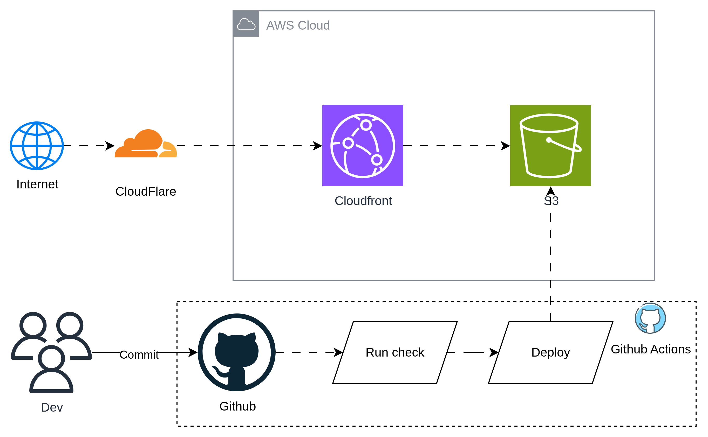
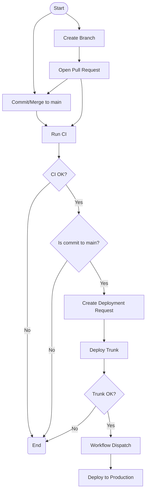

# coangha.dev

[](https://github.com/vippr1237/HaNQ-Portfolio/actions/workflows/app-ci.yml)
[](https://HaNQ-Portfolio)
[](https://vippr1237.github.io)
[](https://vippr1237.dev)

## Overview

This repo contains the source for https://coangha.dev, powered by [AstroWind](https://astro.build/themes/details/astrowind/)

The project is a profolio website hosted in S3 and served to internet via CloudFront. All the change will be checked, build and deployed to coangha.dev

Demo site: http://coangha.dev.s3-website-ap-southeast-1.amazonaws.com/



## Usage

### Pre-reqs

```
# get a copy of the code
git clone https://github.com/loganmarchione/HaNQ-Portfolio.git
cd HaNQ-Portfolio
```

### Commands

All commands are run from the root of the project, from a terminal:

| Command             | Action                                             |
| :------------------ | :------------------------------------------------- |
| `npm install`       | Installs dependencies                              |
| `npm run dev`       | Starts local dev server at `localhost:4321`        |
| `npm run build`     | Build your production site to `./dist/`            |
| `npm run preview`   | Preview your build locally, before deploying       |
| `npm run check`     | Check your project for errors                      |
| `npm run fix`       | Run Eslint and format codes with Prettier          |
| `npm run astro ...` | Run CLI commands like `astro add`, `astro preview` |

<br>

### add, commit, push to kick off GitHub Actions

```
git add .
git commit -m "Update some stuff"
git push
```

## GitHub Actions

Below is a visual representation of the GitHub Actions workflows.


